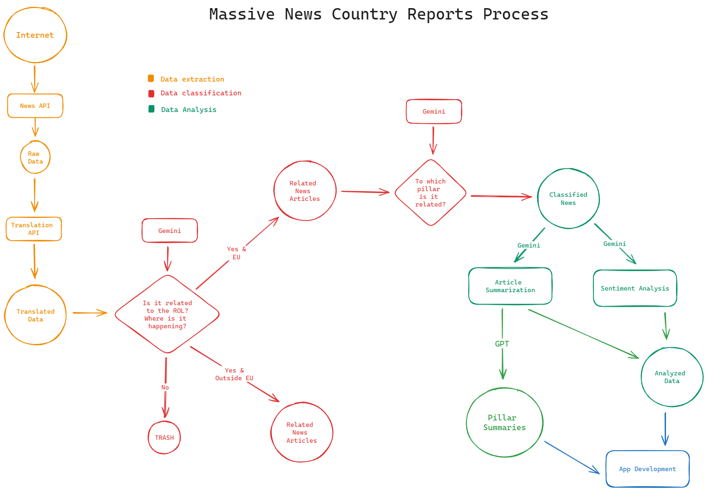

# WJP News Tracker System

This Git repo contains all the code, data, and prompt templates to produce the Media Reports used for the EU GPP Data Validation process conducted by the WJP. The main objective of these Media Reports is to track, identify, classify, and summarize news articles related to the Rule of Law across all 27 member States of the EU. The process is divided into 4 stages:

1. Extraction and translation:

    The raw data is extracted from the web using the [Newscatcher API](https://www.newscatcherapi.com/). For this, a curated list of newspapers and keywords was used to filter down the universe of data. Afterwards, the whole set of news articles is translated to English using the [Deep Translator library](https://github.com/nidhaloff/deep-translator).

2. Sorting and classification

    Once the raw data is translated, we use the [Gemini model](https://deepmind.google/technologies/gemini/#introduction) to classify articles between those related to the Rule of Law, and those that are unrelated. This is known as Phase-1. Around 25% of the whole set of extracted news articles are labelled as related to the Rule of Law. Once we have a pool of news articles related to the Rule of Law, we use Gemini to further classify the news articles depending on which pillar of the Rule of Law are the events narrated in the article related to. A single artiocle can be elated to multiple pillars. Additionally, we use Gemini to provide us with the country (or countries) in which the events narrated in the article are happening.

3. Evaluation and summarization

    The classification stage allow us to fill buckets of data. Each bucket contains news articles related to a country-pillar. A single article could be in multiple buckets. Depending on the bucket, we ask the [Gemini model](https://deepmind.google/technologies/gemini/#introduction) to evaluate how positive or negative are the events narrated in the article to the specific pillar of the Rule of Law. Because of this, if a news article was classified as related to more than one pillar of the Rule of Law, it could end up having more than one impact score. Additionally, we ask the Gemini model to provide with summaries highlighting the points that are related to that specific pillar. In other words, the focus of the impact score and the text summarization changes depending on which pillar is the bucket referring to. inally, we use the [GPT 4 Turbo model](https://platform.openai.com/docs/models/gpt-4-turbo-and-gpt-4) to provide us with summaries highlighting the most relevant issues within each bucket (country-pillar).

4. Report production

    The summaries per country and pillar, along with a search engine, are presented using a dynamic, search-focused platform within the [EU Copilot app](https://eu-copilot.streamlit.app/Media_Reports). The code related to this streamlit app can be found in [this Github repo](https://github.com/ctoruno/EU-copilot).

## Files description
The repo is divided into 3 directories:

1. `code`: containing the scripts, prompts, and notebooks used for the data extraction, translation, classification, and summarization.
2. `data`: containing all the data files from this process. Due to the massive volume of data, the data files are stored in `EU-S Data` folder located in the Sharepoint.
3. `inputs`: containing the curated list of sources and keywords used during the data extraction.

## Code logic 
The code follows a modular approach in which each stage is treated as a separate routine. The notebooks associated to the data extraction are the following:

- `0_EU_news_gathering_0.ipynb`
- `0_EU_news_gathering_1.ipynb`
- `1_EU_news_translation_0.ipynb`
- `1_EU_news_translation_1.ipynb`

The difference between version-0 and version-1 of the data gathering is related to the News API service used. Version-0 refers to a testing routine in which the [Newsdata API](https://newsdata.io/) was used. Version-1 refers to the production version of the extraction and it runs using the [Newscatcher API](https://www.newscatcherapi.com/). Something similar occurs with the version-0 and the version-1 of the translation routines. Version-0 refers to a testing routine in which the [translators library](https://github.com/uliontse/translators) was used. Version-1 refers to the production version of the translation and it runs using the [Deep Translator library](https://github.com/nidhaloff/deep-translator).

The classification stage is contained entirely within the `2_EU_news_classification.ipynb` notebook. In order to run, the user only needs to specify the country and local path to the EU Subnational folder. Additionally, this routine will make use of the prompts defined in the `prompt_templates_classification.py` file.

The notebooks associated to the evaluation and summarization stage are the following:

- `3_EU_news_summarization.ipynb`
- `4_EU_news_pillarSummary.ipynb`

The `3_EU_news_summarization.ipynb` contains the code used to evaluate individual articles using the Gemini model, while the `4_EU_news_pillarSummary.ipynb` contains the code used to provide general summaries for individual country-pillars using the GPT-4-Turbo model. In order to run, the user only needs to specify the country and local path to the EU Subnational folder in each o0f the notebooks. Similar to the classification stage, both routines will make use of the prompts defined in the `prompt_templates_summarization.py` file.

Finally, the routines associated to the classification and evaluation phases will require the user to load the respective API keys through a `.env` file. This file, for obvious reasons, is not being tracked in this repo.

## Contact
For inqueries please contact Carlos Toruño (ctoruno@worldjusticeproject.org).